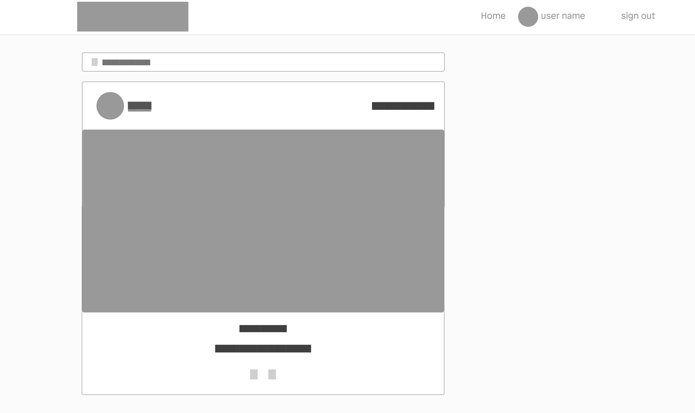

# [HAPPYCARPENTER](https://happy-carpenter-front-26472ba73a7c.herokuapp.com)

[](https://github.com/ibra8080/happycarpenter/commits/main)
[](https://github.com/ibra8080/happycarpenter/commits/main)
[](https://github.com/ibra8080/happycarpenter)


source: [amiresponsive](https://ui.dev/amiresponsive?url=https://happy-carpenter-front-26472ba73a7c.herokuapp.com)

Happy Carpenter is a community website for woodworking enthusiasts and professionals. It provides a platform for users to connect, share their projects, offer services, and arrange collaborations within the woodworking community.


## Project Overview

Happy Carpenter consists of two main components:

1. Backend API: Developed using Django Rest Framework
   - Repository: [Happy Carpenter API](https://github.com/ibra8080/happycarpenter)
   - Deployed at: [Here](https://happy-carpenter-ebf6de9467cb.herokuapp.com/)

2. Frontend Application: Built with React
   - Repository: [Happy Carpenter Frontend](https://github.com/ibra8080/happy-carpenter-front)
   - Deployed at: [Here](https://happy-carpenter-front-26472ba73a7c.herokuapp.com/)

This README focuses on the frontend application, detailing its features, setup, and usage.

## UX

### Colour Scheme

The colour scheme for Happy Carpenter is designed to evoke warmth, professionalism, and a connection to woodworking. The following colors were chosen:

- `#D69723` (Gold) used for primary highlights, representing the warmth of wood and craftsmanship.
- `#a60d0d` (Deep Red) used for secondary highlights, adding a touch of elegance and contrast.
- `#3f3f3f` (Dark Gray) used for primary text, ensuring readability and a professional look.
- `#fffcec` (Off-White) used for the background, providing a soft, warm backdrop that doesn't strain the eyes.

I used [coolors.co](https://coolors.co/d69723-a60d0d-3f3f3f-fffcec) to generate my colour palette.


These colors are defined as CSS variables for easy maintenance and consistency across the site:

```css
:root {
    --primary-color: #a60d0d;
    --secondary-color: #D69723;
    --text-color: #3f3f3f;
    --background-color: #fffcec;
}
```

### Typography

The primary font used throughout the Happy Carpenter website is Poppins. This modern, geometric sans-serif typeface offers excellent readability and a clean, professional look that aligns well with the site's woodworking theme.

- [Poppins](https://fonts.googleapis.com/css2?family=Poppins) is used for all text on the site, with various weights to create hierarchy and emphasis.

The font is imported in the HTML using the following Google Fonts link:

```html
<link href="https://fonts.googleapis.com/css2?family=Poppins:ital,wght@0,100;0,200;0,300;0,400;0,500;0,600;0,700;0,800;0,900;1,100;1,200;1,300;1,400;1,500;1,600;1,700;1,800;1,900&display=swap" rel="stylesheet">
```
### Logo and Imagery

The Happy Carpenter logo features a stylized carpenter's hammer icon, symbolizing the craft and skills central to woodworking. The logo is designed to be simple yet memorable, effectively representing the brand across various media.


The logo is available in different versions to suit various applications:

- Primary logo (full color)
- Icon-only version (for favicons and small applications)
- Typographic version (for text-only contexts)


### User Stories

1. As a user, I can view a navbar from every page so that I can navigate easily between pages.
2. As a logged-out user, I can see sign-in and sign-up options so that I can sign in/sign up.
3. As a user, I can create an account to access all features of the application.
4. As a logged-in user, I can easily log out to ensure the security of my account.
5. As a user, I can tell if I am logged in or not so that I can log in if I need to.
6. As a user, I can view other users' profiles to learn more about them and their work.
7. As a user, I can view users' avatars so that I can easily identify users of the application.
8. As a logged-in user, I can create posts to share my woodworking projects.
9. As a user, I can view all posts to see the latest content from the community.
10. As a logged-in user, I can like posts to show appreciation for other users' work.
11. As a logged-in user, I can comment on posts to engage with the community.
12. As a logged-in user, I can edit my own posts and comments to update or correct information.
13. As a user, I can search and filter posts to find specific content I'm interested in.
14. As a professional user, I can create ads to offer my woodworking services.
15. As a user, I can view ads to find woodworking services or opportunities.

### User Goals

#### Amateur Woodworkers
- Share their projects and get feedback from the community
- Learn from more experienced woodworkers
- Find inspiration for new projects

#### Professional Woodworkers
- Showcase their portfolio of work
- Offer services and attract potential clients
- Network with other professionals in the field

#### General Users
- Explore woodworking projects and techniques
- Connect with woodworking enthusiasts
- Find custom woodworking services


To follow best practice, wireframes were developed for mobile, tablet, and desktop sizes.
I've used [Figma](https://figma.com) to design my site wireframes.

### Mobile Wireframes

<details>
<summary> Click here to see the Mobile Wireframes </summary>

Home
  - 

Profile
  - 

</details>

### Desktop Wireframes

<details>
<summary> Click here to see the Desktop Wireframes </summary>
Home
  - 

Profile
  - 

</details>

## Features

### Existing Features

- **Navigation Bar**

    - The navigation bar is present on all pages, providing easy access to different sections of the site.
    - It includes the Happy Carpenter logo, main navigation links, and user authentication options.
    - The navbar is fully responsive, collapsing into a hamburger menu on smaller screens for better mobile usability.
    - This feature ensures that users can navigate the site efficiently, enhancing overall user experience.


- **User Authentication**

    - Users can sign up for new accounts, log in to existing accounts, and securely log out.
    - This feature allows users to have personalized experiences, manage their own content, and interact with the community.
    - The authentication system ensures data privacy and enables features like posting projects and following other users.


- **Post Creation and Interaction**

    - Users can create posts to share their woodworking projects, including images and descriptions.
    - The community can interact with posts through likes and comments, fostering engagement and discussion.
    - Post owners have the ability to edit or delete their own posts, giving them control over their content.
    - This feature is central to the platform, allowing users to showcase their work and learn from others.


- **User Profiles**

    - Each user has a profile page displaying their information and posted content.
    - Users can edit their profiles, updating information and profile pictures.
    - The follow/unfollow feature allows users to connect with each other and curate their feed.
    - Profiles help build a sense of community and allow users to showcase their woodworking journey.


- **Professional Accounts**

    - Users can identify as professional woodworkers, unlocking additional features.
    - Enhanced profiles for professionals showcase their skills, experience, and services.
    - Clients can leave reviews and ratings for professionals, building trust in the community.
    - Professionals can receive job offers through the platform, creating business opportunities.
    - This feature adds value for skilled woodworkers and clients looking for professional services.


- **Search and Filter**

    - Users can search for specific content or users across the platform.
    - Posts can be filtered by category or user preference, allowing for customized browsing.
    - This feature helps users find relevant content quickly, enhancing the user experience.


- **Responsive Design**

    - The entire application is responsive, providing a seamless experience across desktop, tablet, and mobile devices.
    - This ensures that users can access and enjoy the platform regardless of their device, increasing accessibility and user satisfaction.


🛑🛑🛑🛑🛑🛑🛑🛑🛑🛑 START OF NOTES (to be deleted)

Repeat as necessary for as many features as your site contains.

Hint: the more, the merrier!

🛑🛑🛑🛑🛑🛑🛑🛑🛑🛑-END OF NOTES (to be deleted)

### Future Features

🛑🛑🛑🛑🛑🛑🛑🛑🛑🛑 START OF NOTES (to be deleted)

Do you have additional ideas that you'd like to include on your project in the future?
Fantastic! List them here!
It's always great to have plans for future improvements!
Consider adding any helpful links or notes to help remind you in the future, if you revisit the project in a couple years.

🛑🛑🛑🛑🛑🛑🛑🛑🛑🛑-END OF NOTES (to be deleted)

- YOUR-TITLE-FOR-FUTURE-FEATURE-#1
    - Any additional notes about this feature.
- YOUR-TITLE-FOR-FUTURE-FEATURE-#2
    - Any additional notes about this feature.
- YOUR-TITLE-FOR-FUTURE-FEATURE-#3
    - Any additional notes about this feature.

## Tools & Technologies Used

🛑🛑🛑🛑🛑🛑🛑🛑🛑🛑 START OF NOTES (to be deleted)

In this section, you should explain the various tools and technologies used to develop the project.
Make sure to put a link (where applicable) to the source, and explain what each was used for.
Some examples have been provided, but this is just a sample only, your project might've used others.
Feel free to delete any unused items below as necessary.

🛑🛑🛑🛑🛑🛑🛑🛑🛑🛑-END OF NOTES (to be deleted)

- ⚠️⚠️ REQUIRED <-- delete me ⚠️⚠️
- [](https://tim.2bn.dev/markdown-builder) used to generate README and TESTING templates.
- [](https://git-scm.com) used for version control. (`git add`, `git commit`, `git push`)
- [](https://github.com) used for secure online code storage.
- ⚠️⚠️ IDE: CHOOSE ONLY ONE <-- delete me ⚠️⚠️
- [](https://gitpod.io) used as a cloud-based IDE for development.
- [](https://codeanywhere.com) used as a cloud-based IDE for development.
- [](https://code.visualstudio.com) used as my local IDE for development.
- ⚠️⚠️ LANGUAGES: CHOOSE ALL APPLICABLE <-- delete me ⚠️⚠️
- [](https://en.wikipedia.org/wiki/HTML) used for the main site content.
- [](https://en.wikipedia.org/wiki/CSS) used for the main site design and layout.
- [](https://www.javascript.com) used for user interaction on the site.
- [](https://jquery.com) used for user interaction on the site.
- [](https://www.python.org) used as the back-end programming language.
- ⚠️⚠️ DEPLOYMENT: CHOOSE ONLY ONE <-- delete me ⚠️⚠️
- [](https://pages.github.com) used for hosting the deployed front-end site.
- [](https://www.heroku.com) used for hosting the deployed back-end site.
- ⚠️⚠️ CSS FRAMEWORKS: CHOOSE ONLY ONE (if applicable) <-- delete me ⚠️⚠️
- [](https://getbootstrap.com) used as the front-end CSS framework for modern responsiveness and pre-built components.
- [](https://materializecss.com) used as the front-end CSS framework for modern responsiveness and pre-built components.
- ⚠️⚠️ MISCELLANEOUS: CHOOSE ALL APPLICABLE <-- delete me ⚠️⚠️
- [](https://docs.google.com/spreadsheets) used for storing data from my Python app.
- [](https://jestjs.io) used for automated JavaScript testing.
- [](https://flask.palletsprojects.com) used as the Python framework for the site.
- [](https://www.mongodb.com) used as the non-relational database management with Flask.
- [](https://www.sqlalchemy.org) used as the relational database management with Flask.
- [](https://www.djangoproject.com) used as the Python framework for the site.
- [](https://www.postgresql.org) used as the relational database management.
- [](https://dbs.ci-dbs.net) used as the Postgres database from Code Institute.
- [](https://www.elephantsql.com) used as the Postgres database.
- [](https://cloudinary.com) used for online static file storage.
- [](https://whitenoise.readthedocs.io) used for serving static files with Heroku.
- [](https://stripe.com) used for online secure payments of ecommerce products/services.
- [](https://mail.google.com) used for sending emails in my application.
- [](https://mailchimp.com) used for sending newsletter subscriptions.
- [](https://aws.amazon.com/s3) used for online static file storage.
- [](https://balsamiq.com/wireframes) used for creating wireframes.
- [](https://www.figma.com) used for creating wireframes.
- [](https://www.canva.com/p/canvawireframes) used for creating wireframes.
- [](https://developers.google.com/maps) used as an interactive map on my site.
- [](https://leafletjs.com) used as a free open-source interactive map on my site.
- [](https://fontawesome.com) used for the icons.
- [](https://chat.openai.com) used to help debug, troubleshoot, and explain things.

## Database Design

Entity Relationship Diagrams (ERD) help to visualize database architecture before creating models.
Understanding the relationships between different tables can save time later in the project.

🛑🛑🛑🛑🛑🛑🛑🛑🛑🛑 START OF NOTES (to be deleted)

Using your defined models (one example below), create an ERD with the relationships identified.

🛑🛑🛑🛑🛑🛑🛑🛑🛑🛑-END OF NOTES (to be deleted)

```python
class Product(models.Model):
    category = models.ForeignKey(
        "Category", null=True, blank=True, on_delete=models.SET_NULL)
    sku = models.CharField(max_length=254, null=True, blank=True)
    name = models.CharField(max_length=254)
    description = models.TextField()
    has_sizes = models.BooleanField(default=False, null=True, blank=True)
    price = models.DecimalField(max_digits=6, decimal_places=2)
    rating = models.DecimalField(
        max_digits=6, decimal_places=2, null=True, blank=True)
    image_url = models.URLField(max_length=1024, null=True, blank=True)
    image = models.ImageField(null=True, blank=True)

    def __str__(self):
        return self.name
```

🛑🛑🛑🛑🛑🛑🛑🛑🛑🛑 START OF NOTES (to be deleted)

A couple recommendations for building free ERDs:
- [Draw.io](https://draw.io)
- [Lucidchart](https://www.lucidchart.com/pages/ER-diagram-symbols-and-meaning)

A more comprehensive ERD can be auto-generated once you're
at the end of your development stages, just before you submit.
Follow the steps below to obtain a thorough ERD that you can include.
Feel free to leave the steps in the README for future use to yourself.

🛑🛑🛑🛑🛑🛑🛑🛑🛑🛑-END OF NOTES (to be deleted)

I have used `pygraphviz` and `django-extensions` to auto-generate an ERD.

The steps taken were as follows:
- In the terminal: `sudo apt update`
- then: `sudo apt-get install python3-dev graphviz libgraphviz-dev pkg-config`
- then type `Y` to proceed
- then: `pip3 install django-extensions pygraphviz`
- in my `settings.py` file, I added the following to my `INSTALLED_APPS`:
```python
INSTALLED_APPS = [
    ...
    'django_extensions',
    ...
]
```
- back in the terminal: `python3 manage.py graph_models -a -o erd.png`
- dragged the new `erd.png` file into my `documentation/` folder
- removed `'django_extensions',` from my `INSTALLED_APPS`
- finally, in the terminal: `pip3 uninstall django-extensions pygraphviz -y`


source: [medium.com](https://medium.com/@yathomasi1/1-using-django-extensions-to-visualize-the-database-diagram-in-django-application-c5fa7e710e16)


## Agile Development Process

### GitHub Projects

[GitHub Projects](https://github.com/ibra8080/happycarpenter/projects) served as an Agile tool for this project.
It isn't a specialized tool, but with the right tags and project creation/issue assignments, it can be made to work.

Through it, user stories, issues, and milestone tasks were planned, then tracked on a weekly basis using the basic Kanban board.

🛑🛑🛑🛑🛑🛑🛑🛑🛑🛑 START OF NOTES (to be deleted)

Consider adding a basic screenshot of your Projects Board.

🛑🛑🛑🛑🛑🛑🛑🛑🛑🛑-END OF NOTES (to be deleted)


### GitHub Issues

[GitHub Issues](https://github.com/ibra8080/happycarpenter/issues) served as an another Agile tool.
There, I used my own **User Story Template** to manage user stories.

It also helped with milestone iterations on a weekly basis.

🛑🛑🛑🛑🛑🛑🛑🛑🛑🛑 START OF NOTES (to be deleted)

Consider adding a screenshot of your Open and Closed Issues.

🛑🛑🛑🛑🛑🛑🛑🛑🛑🛑-END OF NOTES (to be deleted)

- [Open Issues](https://github.com/ibra8080/happycarpenter/issues) [](https://github.com/ibra8080/happycarpenter/issues)

    

- [Closed Issues](https://github.com/ibra8080/happycarpenter/issues?q=is%3Aissue+is%3Aclosed) [](https://github.com/ibra8080/happycarpenter/issues?q=is%3Aissue+is%3Aclosed)

    

### MoSCoW Prioritization

I've decomposed my Epics into stories prior to prioritizing and implementing them.
Using this approach, I was able to apply the MoSCow prioritization and labels to my user stories within the Issues tab.

- **Must Have**: guaranteed to be delivered (*max 60% of stories*)
- **Should Have**: adds significant value, but not vital (*the rest ~20% of stories*)
- **Could Have**: has small impact if left out (*20% of stories*)
- **Won't Have**: not a priority for this iteration

## Testing

> [!NOTE]  
> For all testing, please refer to the [TESTING.md](TESTING.md) file.

## Deployment

🛑🛑🛑🛑🛑🛑🛑🛑🛑🛑-START OF NOTES (to be deleted)

**IMPORTANT:**

- ⚠️ DO NOT update the environment variables to your own! These should NOT be included in this file; just demo values! ⚠️
- ⚠️ DO NOT update the environment variables to your own! These should NOT be included in this file; just demo values! ⚠️
- ⚠️ DO NOT update the environment variables to your own! These should NOT be included in this file; just demo values! ⚠️

🛑🛑🛑🛑🛑🛑🛑🛑🛑🛑-END OF NOTES (to be deleted)

The live deployed application can be found deployed on [Heroku](https://happy-carpenter-front-26472ba73a7c.herokuapp.com).

### PostgreSQL Database

This project uses a [Code Institute PostgreSQL Database](https://dbs.ci-dbs.net).

To obtain my own Postgres Database from Code Institute, I followed these steps:

- Signed-in to the CI LMS using my email address.
- An email was sent to me with my new Postgres Database.

> [!CAUTION]  
> - PostgreSQL databases by Code Institute are only available to CI Students.
> - You must acquire your own PostgreSQL database through some other method
> if you plan to clone/fork this repository.
> - Code Institute students are allowed a maximum of 8 databases.
> - Databases are subject to deletion after 18 months.

### Cloudinary API

This project uses the [Cloudinary API](https://cloudinary.com) to store media assets online, due to the fact that Heroku doesn't persist this type of data.

To obtain your own Cloudinary API key, create an account and log in.

- For *Primary interest*, you can choose *Programmable Media for image and video API*.
- Optional: *edit your assigned cloud name to something more memorable*.
- On your Cloudinary Dashboard, you can copy your **API Environment Variable**.
- Be sure to remove the `CLOUDINARY_URL=` as part of the API **value**; this is the **key**.

### Heroku Deployment

This project uses [Heroku](https://www.heroku.com), a platform as a service (PaaS) that enables developers to build, run, and operate applications entirely in the cloud.

Deployment steps are as follows, after account setup:

- Select **New** in the top-right corner of your Heroku Dashboard, and select **Create new app** from the dropdown menu.
- Your app name must be unique, and then choose a region closest to you (EU or USA), and finally, select **Create App**.
- From the new app **Settings**, click **Reveal Config Vars**, and set your environment variables.

> [!IMPORTANT]  
> This is a sample only; you would replace the values with your own if cloning/forking my repository.

| Key | Value |
| --- | --- |
| `CLOUDINARY_URL` | user's own value |
| `DATABASE_URL` | user's own value |
| `DISABLE_COLLECTSTATIC` | 1 (*this is temporary, and can be removed for the final deployment*) |
| `SECRET_KEY` | user's own value |

Heroku needs three additional files in order to deploy properly.

- requirements.txt
- Procfile
- runtime.txt

You can install this project's **requirements** (where applicable) using:

- `pip3 install -r requirements.txt`

If you have your own packages that have been installed, then the requirements file needs updated using:

- `pip3 freeze --local > requirements.txt`

The **Procfile** can be created with the following command:

- `echo web: gunicorn app_name.wsgi > Procfile`
- *replace **app_name** with the name of your primary Django app name; the folder where settings.py is located*

The **runtime.txt** file needs to know which Python version you're using:
1. type: `python3 --version` in the terminal.
2. in the **runtime.txt** file, add your Python version:
	- `python-3.9.19`

For Heroku deployment, follow these steps to connect your own GitHub repository to the newly created app:

Either:

- Select **Automatic Deployment** from the Heroku app.

Or:

- In the Terminal/CLI, connect to Heroku using this command: `heroku login -i`
- Set the remote for Heroku: `heroku git:remote -a app_name` (replace *app_name* with your app name)
- After performing the standard Git `add`, `commit`, and `push` to GitHub, you can now type:
	- `git push heroku main`

The project should now be connected and deployed to Heroku!

### Local Deployment

This project can be cloned or forked in order to make a local copy on your own system.

For either method, you will need to install any applicable packages found within the *requirements.txt* file.

- `pip3 install -r requirements.txt`.

You will need to create a new file called `env.py` at the root-level,
and include the same environment variables listed above from the Heroku deployment steps.

> [!IMPORTANT]  
> This is a sample only; you would replace the values with your own if cloning/forking my repository.

Sample `env.py` file:

```python
import os

os.environ.setdefault("CLOUDINARY_URL", "user's own value")
os.environ.setdefault("DATABASE_URL", "user's own value")
os.environ.setdefault("SECRET_KEY", "user's own value")

# local environment only (do not include these in production/deployment!)
os.environ.setdefault("DEBUG", "True")
```

Once the project is cloned or forked, in order to run it locally, you'll need to follow these steps:

- Start the Django app: `python3 manage.py runserver`
- Stop the app once it's loaded: `CTRL+C` or `⌘+C` (Mac)
- Make any necessary migrations: `python3 manage.py makemigrations`
- Migrate the data to the database: `python3 manage.py migrate`
- Create a superuser: `python3 manage.py createsuperuser`
- Load fixtures (if applicable): `python3 manage.py loaddata file-name.json` (repeat for each file)
- Everything should be ready now, so run the Django app again: `python3 manage.py runserver`

#### Cloning

You can clone the repository by following these steps:

1. Go to the [GitHub repository](https://github.com/ibra8080/happycarpenter) 
2. Locate the Code button above the list of files and click it 
3. Select if you prefer to clone using HTTPS, SSH, or GitHub CLI and click the copy button to copy the URL to your clipboard
4. Open Git Bash or Terminal
5. Change the current working directory to the one where you want the cloned directory
6. In your IDE Terminal, type the following command to clone my repository:
	- `git clone https://github.com/ibra8080/happycarpenter.git`
7. Press Enter to create your local clone.

Alternatively, if using Gitpod, you can click below to create your own workspace using this repository.

[](https://gitpod.io/#https://github.com/ibra8080/happycarpenter)

Please note that in order to directly open the project in Gitpod, you need to have the browser extension installed.
A tutorial on how to do that can be found [here](https://www.gitpod.io/docs/configure/user-settings/browser-extension).

#### Forking

By forking the GitHub Repository, we make a copy of the original repository on our GitHub account to view and/or make changes without affecting the original owner's repository.
You can fork this repository by using the following steps:

1. Log in to GitHub and locate the [GitHub Repository](https://github.com/ibra8080/happycarpenter)
2. At the top of the Repository (not top of page) just above the "Settings" Button on the menu, locate the "Fork" Button.
3. Once clicked, you should now have a copy of the original repository in your own GitHub account!

### Local VS Deployment

🛑🛑🛑🛑🛑🛑🛑🛑🛑🛑-START OF NOTES (to be deleted)

Use this space to discuss any differences between the local version you've developed, and the live deployment site on Heroku.

🛑🛑🛑🛑🛑🛑🛑🛑🛑🛑-END OF NOTES (to be deleted)

## Credits

🛑🛑🛑🛑🛑🛑🛑🛑🛑🛑-START OF NOTES (to be deleted)

In this section you need to reference where you got your content, media, and extra help from.
It is common practice to use code from other repositories and tutorials,
however, it is important to be very specific about these sources to avoid plagiarism.

🛑🛑🛑🛑🛑🛑🛑🛑🛑🛑-END OF NOTES (to be deleted)

### Content

🛑🛑🛑🛑🛑🛑🛑🛑🛑🛑-START OF NOTES (to be deleted)

Use this space to provide attribution links to any borrowed code snippets, elements, or resources.
A few examples have been provided below to give you some ideas.

Ideally, you should provide an actual link to every resource used, not just a generic link to the main site!

⚠️⚠️ EXAMPLE LINKS - REPLACE WITH YOUR OWN ⚠️⚠️

🛑🛑🛑🛑🛑🛑🛑🛑🛑🛑-END OF NOTES (to be deleted)

| Source | Location | Notes |
| --- | --- | --- |
| [Markdown Builder](https://tim.2bn.dev/markdown-builder) | README and TESTING | tool to help generate the Markdown files |
| [Chris Beams](https://chris.beams.io/posts/git-commit) | version control | "How to Write a Git Commit Message" |
| [W3Schools](https://www.w3schools.com/howto/howto_js_topnav_responsive.asp) | entire site | responsive HTML/CSS/JS navbar |
| [W3Schools](https://www.w3schools.com/howto/howto_css_modals.asp) | contact page | interactive pop-up (modal) |
| [W3Schools](https://www.w3schools.com/css/css3_variables.asp) | entire site | how to use CSS :root variables |
| [Flexbox Froggy](https://flexboxfroggy.com/) | entire site | modern responsive layouts |
| [Grid Garden](https://cssgridgarden.com) | entire site | modern responsive layouts |
| [StackOverflow](https://stackoverflow.com/a/2450976) | quiz page | Fisher-Yates/Knuth shuffle in JS |
| [YouTube](https://www.youtube.com/watch?v=YL1F4dCUlLc) | leaderboard | using `localStorage()` in JS for high scores |
| [YouTube](https://www.youtube.com/watch?v=u51Zjlnui4Y) | PP3 terminal | tutorial for adding color to the Python terminal |
| [strftime](https://strftime.org) | CRUD functionality | helpful tool to format date/time from string |
| [WhiteNoise](http://whitenoise.evans.io) | entire site | hosting static files on Heroku temporarily |

### Media

🛑🛑🛑🛑🛑🛑🛑🛑🛑🛑-START OF NOTES (to be deleted)

Use this space to provide attribution links to any images, videos, or audio files borrowed from online.
A few examples have been provided below to give you some ideas.

If you're the owner (or a close acquaintance) of all media files, then make sure to specify this.
Let the assessors know that you have explicit rights to use the media files within your project.

Ideally, you should provide an actual link to every media file used, not just a generic link to the main site!
The list below is by no means exhaustive. Within the Code Institute Slack community, you can find more "free media" links
by sending yourself the following command: `!freemedia`.

⚠️⚠️ EXAMPLE LINKS - REPLACE WITH YOUR OWN ⚠️⚠️

🛑🛑🛑🛑🛑🛑🛑🛑🛑🛑-END OF NOTES (to be deleted)

| Source | Location | Type | Notes |
| --- | --- | --- | --- |
| [Pexels](https://www.pexels.com) | entire site | image | favicon on all pages |
| [Lorem Picsum](https://picsum.photos) | home page | image | hero image background |
| [Unsplash](https://unsplash.com) | product page | image | sample of fake products |
| [Pixabay](https://pixabay.com) | gallery page | image | group of photos for gallery |
| [Wallhere](https://wallhere.com) | footer | image | background wallpaper image in the footer |
| [This Person Does Not Exist](https://thispersondoesnotexist.com) | testimonials | image | headshots of fake testimonial images |
| [Audio Micro](https://www.audiomicro.com/free-sound-effects) | game page | audio | free audio files to generate the game sounds |
| [Videvo](https://www.videvo.net/) | home page | video | background video on the hero section |
| [TinyPNG](https://tinypng.com) | entire site | image | tool for image compression |

### Acknowledgements

🛑🛑🛑🛑🛑🛑🛑🛑🛑🛑-START OF NOTES (to be deleted)

Use this space to provide attribution to any supports that helped, encouraged, or supported you throughout the development stages of this project.
A few examples have been provided below to give you some ideas.

⚠️⚠️ EXAMPLES ONLY - REPLACE WITH YOUR OWN ⚠️⚠️

🛑🛑🛑🛑🛑🛑🛑🛑🛑🛑-END OF NOTES (to be deleted)

- I would like to thank my Code Institute mentor, [Tim Nelson](https://github.com/TravelTimN) for his support throughout the development of this project.
- I would like to thank the [Code Institute](https://codeinstitute.net) tutor team for their assistance with troubleshooting and debugging some project issues.
- I would like to thank the [Code Institute Slack community](https://code-institute-room.slack.com) for the moral support; it kept me going during periods of self doubt and imposter syndrome.
- I would like to thank my partner (John/Jane), for believing in me, and allowing me to make this transition into software development.
- I would like to thank my employer, for supporting me in my career development change towards becoming a software developer.


# Happy Carpenter


## Project Overview


### Future Features

- Messaging system for direct user communication
- Geolocation integration for localized service matching
- Professionals can advertise their work through featured listings or sponsored content
- Users can follow each other to stay updated on specific woodworkers' activities

## Tools & Technologies Used

- [](https://tim.2bn.dev/markdown-builder) used to generate README and TESTING templates.
- [](https://git-scm.com) used for version control. (`git add`, `git commit`, `git push`)
- [](https://github.com) used for secure online code storage.
- ⚠️⚠️ IDE: CHOOSE ONLY ONE <-- delete me ⚠️⚠️
- [](https://gitpod.io) used as a cloud-based IDE for development.
- [](https://en.wikipedia.org/wiki/HTML) used for the main site content.
- [](https://en.wikipedia.org/wiki/CSS) used for the main site design and layout.
- [](https://www.javascript.com) used for user interaction on the site.
- [](https://jquery.com) used for user interaction on the site.
- [](https://www.heroku.com) used for hosting the deployed back-end site.
- [](https://getbootstrap.com) used as the front-end CSS framework for modern responsiveness and pre-built components.
- [](https://jestjs.io) used for automated JavaScript testing.
- [](https://dbs.ci-dbs.net) used as the Postgres database from Code Institute.
- [](https://cloudinary.com) used for online static file storage.
- [](https://www.figma.com) used for creating wireframes.
- [](https://fontawesome.com) used for the icons.
- [](https://chat.openai.com) used to help debug, troubleshoot, and explain things.

## Setup and Installation

To get the Happy Carpenter application running on your local machine, follow these steps:

### Prerequisites

- Node.js (v14.0.0 or later)
- npm (usually comes with Node.js)
- Git

### Clone the Repository

1. Open your terminal
2. Clone the repository:
git clone https://github.com/ibra8080/happy-carpenter-front.git
3. Navigate to the project directory:
cd happy-carpenter-front
### Install Dependencies

Install the project dependencies:
npm install
### Set Up Environment Variables

1. Create a `.env` file in the root directory of the project
2. Add the following variables to the `.env` file:
REACT_APP_API_URL=https://happy-carpenter-ebf6de9467cb.herokuapp.com
Replace the URL with your API URL if different.

### Run the Application

Start the development server: npmstart
The application should now be running on [http://localhost:3000](http://localhost:3000).

### Building for Production

To create a production build:npm run build
This will create a `build` directory with a production build of your app.

### Connect to the Backend

Ensure that the backend API is running and accessible. You may need to update the `REACT_APP_API_URL` in the `.env` file to point to your local backend server if you're running it locally.

### Additional Notes

- Make sure you have the necessary API keys and access to any external services used in the project.
- If you encounter any CORS issues, ensure that your backend is configured to accept requests from your frontend's URL.

## Testing

Testing, validations and bugs can be found 